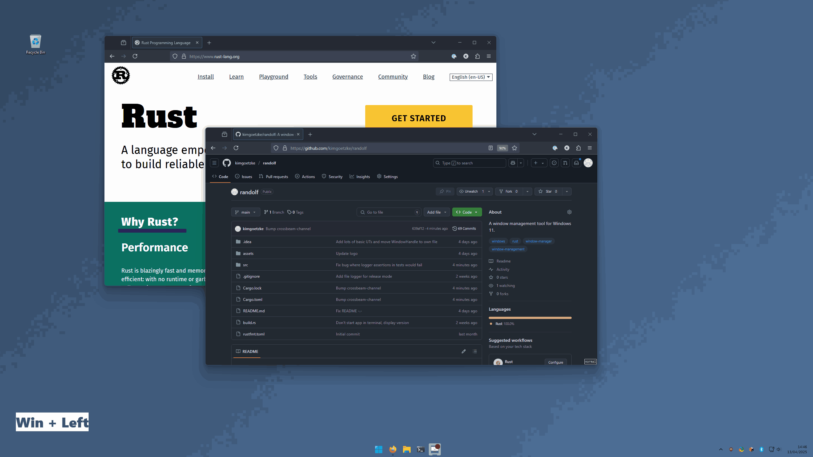
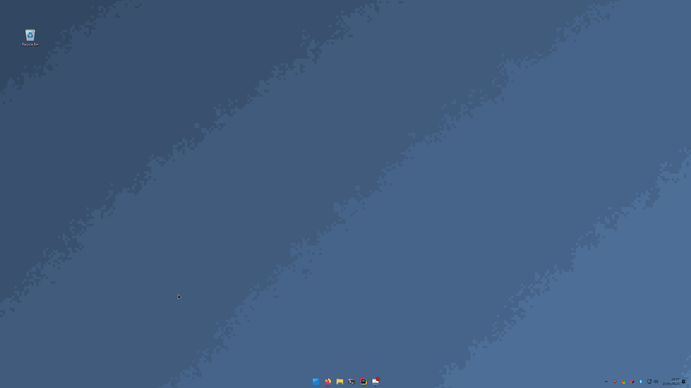
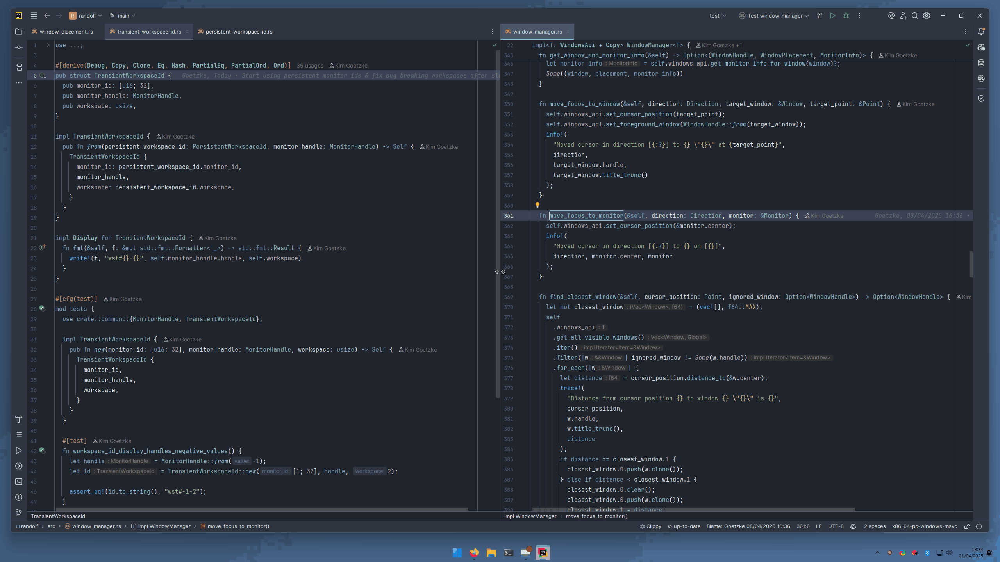

<p align="center">
  
</p>

# Meet Randolf

Randolf is a basic window manager for Windows 11 that provides window tiling-like functionality. Randolf allows you
to:

- `Win` + `\` - near-maximise the active window (maximise minus margin).
- `Win` + `Shift` + `Left`/`Top`/`Right`/`Down` or `h`/`j`/`k`/`l` - near-snap (snap minus margin) the active window
  to the left, top, right, or bottom of the screen.
- `Win` + `Left`/`Top`/`Right`/`Down` - move the cursor to the closest window in the direction of the arrow key (and
  activate the window) or to the center of the window-free monitor, if it exists.
- `Win` + `q` - close the active window.
- `Win` + `1`/`2`/... - switch between workspaces.
- `Win` + `Shift` + `1`/`2`/... - move the active window to respective workspace.
- Configure an arbitrary number of hotkeys for launching applications (e.g. `Win` + `f` to launch Firefox) via the
  configuration file.

My goal for this project was to implement some key window navigation concepts
from [my Linux configuration](https://github.com/kimgoetzke/nixos-config) for Windows, offering an experience,
somewhat closer to that of Linux window managers/compositors such as [Hyprland](https://hyprland.org/). The
application was created to meet my own needs and started as migration of [Randy](https://github.com/kimgoetzke/randy)
from C#/.NET to Rust, however contributions and suggestions (via issues) are welcome.

#### Additional features

- Pressing `Win` + `\` on a near-maximised window will reset the window to its previous size and position (i.e. undo the
  near-maximisation)
- Writes application logs to a file in the directory of the executable (can be disabled)
- Stores and loads configuration from `randolf.toml` in the directory of the executable
- Tray icon with a context menu
    - Allows customising the window margin
    - Allows closing the application

## Demo

Selecting and moving windows using hotkeys:


Opening and closing applications using hotkeys:


_Note that the newly opened application is focussed upon opening and, after closing a window, the closest window  (if
any) is selected._

Switching between workspaces and moving windows between them:


#### Features currently under consideration

- Allow customising modifier keys and/or customising window/workspace management hotkeys
- Allow auto-start application on startup
- Group "snapped" window on a single screen and allow resizing them together
- Allow moving windows with `Win` + `Left Mouse Button` dragging
- Allow resizing windows with `Win` + `Right Mouse Button` dragging

## How to configure

The configuration file `randolf.toml` is located in the same directory as the executable after the first start. The
configuration file is created with the following default values:

```toml
[general]
window_margin = 20
allow_selecting_same_center_windows = true
additional_workspace_count = 3
```

##### window_margin

Default: `20`

The margin in pixels that is used when near-maximising or near-snapping a window. The margin is subtracted from the size
of the screen when calculating the size and position of the window. Can be configured via the tray icon context menu.

##### allow_selecting_same_center_windows

Default: `true`

Whether to allow selecting windows, the center of which is the same as the center of the active window. Enabling this
effectively means that the cursor cannot be moved away from two windows of the same size (as their centers are the
same) until at least one of them is moved/resized. Disabling this, however, means that you will no longer be able to
select the non-foreground window of the windows with the same center using this application. Can be configured via the
tray icon context menu.

##### additional_workspace_count

Default: `3`

The number of virtual workspaces that are created on the primary monitor by Randolf. Workspaces are similar to Windows
desktops but only apply to a single monitor and are much faster to switch.

##### Launcher hotkeys

In addition to the above, the application also supports setting custom application launcher hotkeys via the configuration file like so:

```toml
[[hotkey]]
name = "Browser"
path = "C:\\Program Files\\Mozilla Firefox\\firefox.exe"
hotkey = "F"
execute_as_admin = false

[[hotkey]]
name = "File Explorer"
path = "explorer.exe"
hotkey = "M"
execute_as_admin = false
```

- `name`: The name of the hotkey. This is used to identify the hotkey in logs but has no other value.
- `path`: The path to the executable of the application to be started. Must use double backslashes (`\\`) as path
  separators. If the executable is in the system path, you can use just the name of the executable (e.g.
  `wt.exe`).
- `hotkey`: The key name (
  see [list of options](https://github.com/iholston/win-hotkeys/blob/f5f903a725ce309f86608bba6d8a76fb6efb97b8/src/keys.rs#L506))
  to be used to start the application. Modifier key is always `Win`. Must be a single key.
- `execute_as_admin`: Whether to execute the application as administrator. If unsure, set this to `false`.
- You can define an arbitrary number of hotkeys.
- Using the same key for multiple hotkeys is not supported.
- Hotkeys cannot be configured via the tray icon context menu.

## FAQ

### How can I get this application to launch when Windows starts?

You can create a shortcut to the executable and place it in the startup folder (
`$HOME\AppData\Roaming\Microsoft\Windows\Start Menu\Programs\Startup`). To do this:

1. Create a shortcut to the executable and cut it
2. Press `Win` + `r`, type `shell:startup`, and press `Enter`
3. Paste the shortcut into the startup folder

### Why does this application even exist? What it is purpose?

While [Komorebi](https://github.com/LGUG2Z/komorebi/) is the most feature-rich window tiling manager for Windows I
know, it requires a commercial license (particularly problematic for since I only use Windows for work), depends on a
separate hotkey daemon, and enforces tiling for all windows unless explicitly excepted. I also experienced stability and
configuration issues during my usage.

Randolf was created as a simpler alternative that:

- Does not require a paid commercial license
- Runs as a standalone application
- Only includes a handful of essential window management features
- Provides hotkeys to facilitate a clean desktop without forcing automatic tiling
- Serves as a fun, little personal learning project

If you are looking for something more sophisticated and feature-rich, I strongly recommend checking
out [Komorebi](https://github.com/LGUG2Z/komorebi/).

## How to develop

### Prerequisites

You'll need the C++ tools from the Build Tools for Visual Studio installed.

Useful links:

- [Programming reference for the Win32 API](https://learn.microsoft.com/en-us/windows/win32/api/)
