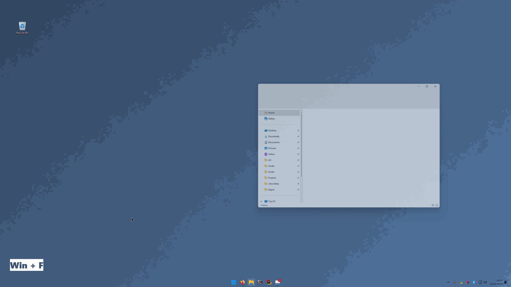
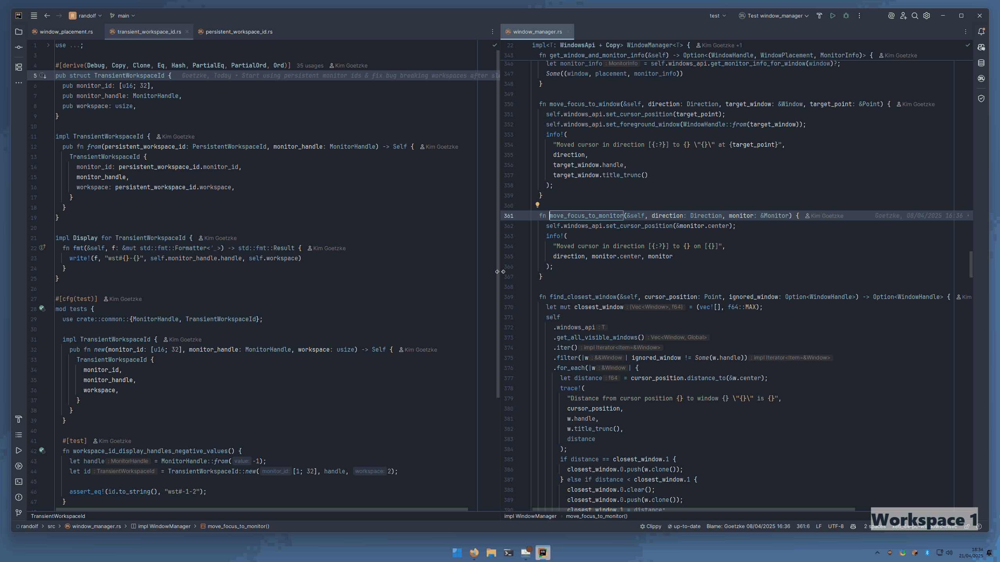

<p align="center">
  
</p>

# Meet Randolf

Randolf is a window management utility for Windows 11 that allows you to:

- `Win` + `\` - near-maximise \the foreground window (maximise minus margin).
- `Win` + `Shift` + `Left`/`Top`/`Right`/`Down` or `h`/`j`/`k`/`l` - near-snap (snap minus margin) the foreground window
  to the left, top, right, or bottom of the screen.
- `Win` + `Left`/`Top`/`Right`/`Down` - move the cursor to the closest window in the direction of the arrow key (and
  activate the window) or to the center of the window-free monitor, if it exists.
- `Win` + `q` - close the foreground window.
- `Win` + `1`/`2`/... - switch between workspaces.
- `Win` + `Shift` + `1`/`2`/... - move the foreground window to respective workspace.
- Hold `Win` + `Left click` - select a window anywhere and move it i.e. without having to select the title bar.
- Hold `Win` + `Right click` - select a window anywhere and resize it i.e. without having to select the edges or
  corners.
- Configure an arbitrary number of hotkeys for launching applications (e.g. `Win` + `f` to launch Firefox) via the
  configuration file.

My goal for this project was to implement some key window navigation concepts
from [my Linux configuration](https://github.com/kimgoetzke/nixos-config) for Windows, offering an experience, somewhat
closer to that of Linux window managers/compositors such as [Hyprland](https://hyprland.org/) without
_enforcing_ window tiling. The application was created to meet my own needs and started as migration of
[Randy](https://github.com/kimgoetzke/randy) from C#/.NET to Rust, however contributions and suggestions (via
issues) are welcome.

#### Additional features

- Reset the window to its previous size and position (i.e. undo the near-maximisation) by pressing `Win` + `\` on a
  near-maximised window will
- Minimise the foreground window by pressing `Win` + `Shift` + `\`
- Store and load configuration from `randolf.toml` in `%APPDATA%\kimgoetzke\randolf\`
- Write application logs to `randolf.log` in `%LOCALAPPDATA%\kimgoetzke\randolf\logs\`
- Display a tray icon that also functions as a workspace indicator and has a context menu that allows you to...
    - Print a visual representation of the perceived monitor layout to the log file
    - Customise the window margin
    - Open the folder containing the Randolf executable in File Explorer
    - Restart the application (which will reload `randolf.toml` prior to restarting) with or without admin privileges
    - Close the application which restores all hidden windows

## Demo

Selecting and moving windows using hotkeys only:


Opening and closing applications using hotkeys only:

_Note that the newly opened application is focussed upon opening and, after closing a window, the closest window  (if
any) is selected._

Switching between workspaces and moving windows between them using hotkeys only:


Moving and resizing windows using the mouse while holding the `Win` key:


## How to configure

> [!NOTE]
> The application will automatically create a configuration file with sensible defaults on the first run. The location
> of the configuration file is `%APPDATA%\kimgoetzke\randolf\config\randolf.toml`.

The default configuration file looks like this:

```toml
[general]
window_margin = 20
allow_selecting_same_center_windows = true
force_using_admin_privileges = false
additional_workspace_count = 2
enable_features_using_mouse = true
delay_in_ms_before_dragging_is_allowed = 750

[exclusion_settings]
window_titles = [
    "Program Manager",
    "Windows Input Experience",
    # And more...
]
window_class_names = [
    "Progman",
    "WorkerW",
    "Shell_TrayWnd",
    "Shell_SecondaryTrayWnd",
    # And more...
]
```

### General settings

The `[general]` section contains the general settings for the application.

| Key                                      | Default value | Description                                                                                                                                                                                                                                                                                                                                                                                                                                                                                                         |
|------------------------------------------|---------------|---------------------------------------------------------------------------------------------------------------------------------------------------------------------------------------------------------------------------------------------------------------------------------------------------------------------------------------------------------------------------------------------------------------------------------------------------------------------------------------------------------------------|
| `window_margin`                          | `20`          | The margin in pixels that is used when near-maximising or near-snapping a window. The margin is subtracted from the size of the screen (the monitors work area) when calculating the size and position of the window. Can be configured via the tray icon context menu.                                                                                                                                                                                                                                             |
| `allow_selecting_same_center_windows`    | `true`        | Whether to allow selecting windows, the center of which is the same as the center of the active window. Enabling this effectively means that the cursor cannot be moved away from two windows of the same size (as their centers are the same) until at least one of them is moved/resized. Disabling this, however, means that you will no longer be able to select the non-foreground window of the windows with the same center using this application. Can be configured via the tray icon context menu.        |
| `force_using_admin_privileges`           | `false`       | Whether to force the application to run with admin privileges. This will restart the application with admin privileges if it is not already running with them. Without admin privileges, the application will not be able to interact at all with other applications that are running with admin privileges. If you (semi-)regularly use applications that require admin privileges, you should set this to `true` or, even better, simply start Randolf with admin privileges directly.                            |
| `additional_workspace_count`             | `2`           | The number of virtual workspaces that are created on the primary monitor by Randolf. Workspaces are similar to Windows desktops but only apply to a single monitor and are much faster to switch.                                                                                                                                                                                                                                                                                                                   |
| `enable_features_using_mouse`            | `true`        | Whether to enable the features that allow moving and resizing windows using the mouse. The advantage of this feature over the native Windows approach is that you don't have to select the title bar to move or the edges of a window to resize - you can simply do it anywhere while holding the `Win` key. If you do not want to use these features, you can set this to `false`.                                                                                                                                 |
| `delay_in_ms_before_dragging_is_allowed` | `750`         | Only used when `enable_features_using_mouse` is `true`. Defines the time in milliseconds for which you have to hold `Win` before the application allows you to move or resize a window. The idea here is to prevent enabling these modes when you press the `Win` key quickly for any other reason i.e. setting this to a non-zero value can prevent you from accidental dragging or resizing of windows. Lower this delay if you want mouse-based features to be more responsive, esp. if you use them frequently. |

### Exclusion settings

The `[exclusion_settings]` section contains the settings for excluding certain windows from being interactable (e.g.
selectable/movable) via the application. A small number of windows are excluded by default in order for the application
to function properly.

You can add additional windows to the exclusion list by adding their title or class name to the `[exclusion_settings]`
section. Randolf currently does not provide any features to identify the title or class name of a window other than
logging the _title_ of a window when it is being interacted with via the application.

### Application launcher hotkeys

Hotkeys are not present in the default configuration file and must be added manually with a `[[hotkey]]` section. With
this, you can configure custom application launcher hotkeys via the configuration file like so:

```toml
[[hotkey]]
name = "Browser"
path = "C:\\Program Files\\Mozilla Firefox\\firefox.exe"
hotkey = "F"
execute_as_admin = false

[[hotkey]]
name = "File Explorer"
path = "explorer.exe"
hotkey = "M"
execute_as_admin = false
```

- `name`: The name of the hotkey. This is used to identify the hotkey in logs but has no other value.
- `path`: The path to the executable of the application to be started. Use double backslashes (`\\`) as path
  separators when declaring the path using `"`. If the executable is in the system path, you can use just the name of
  the executable (e.g. `wt.exe`).
- `hotkey`: The key name (
  see [list of options](https://github.com/iholston/win-hotkeys/blob/f5f903a725ce309f86608bba6d8a76fb6efb97b8/src/keys.rs#L506))
  to be used to start the application. Modifier key is always `Win` (feel free to raise an GitHub issue to change this).
  Must be a single key.
- `execute_as_admin`: Whether to execute the application with administrator privileges. If unsure, set this to `false`.
- You can define an arbitrary number of hotkeys.
- Using the same key for multiple hotkeys is not supported.

## FAQ

### How can I get this application to launch when Windows starts?

You can create a shortcut to the executable and place it in the startup folder (
`$HOME\AppData\Roaming\Microsoft\Windows\Start Menu\Programs\Startup`). To do this:

1. Create a shortcut to the executable and cut it
2. Press `Win` + `r`, type `shell:startup`, and press `Enter`
3. Paste the shortcut into the startup folder

### Why does this application even exist? What is its purpose?

While [Komorebi](https://github.com/LGUG2Z/komorebi/) is the most feature-rich window tiling manager for Windows I know,
it requires a commercial license (particularly problematic for me since I only use Windows for work), depends on a
separate hotkey daemon, and enforces tiling for all windows unless explicitly excepted.

Randolf was created as a simpler alternative that:

- Does not require a paid commercial license
- Runs as a standalone application
- Only includes a handful of essential window management features
- Provides hotkeys to facilitate a clean desktop without forcing automatic tiling
- Served as a fun, little personal learning project

If you are looking for a feature-rich window manager, I strongly recommend checking
out [Komorebi](https://github.com/LGUG2Z/komorebi/).

## How to develop

### Prerequisites

You'll need the C++ tools from the Build Tools for Visual Studio installed.

Useful links:

- [Download Build Tools for Visual Studio](https://visualstudio.microsoft.com/downloads/#build-tools)
- [Programming reference for the Win32 API](https://learn.microsoft.com/en-us/windows/win32/api/)
